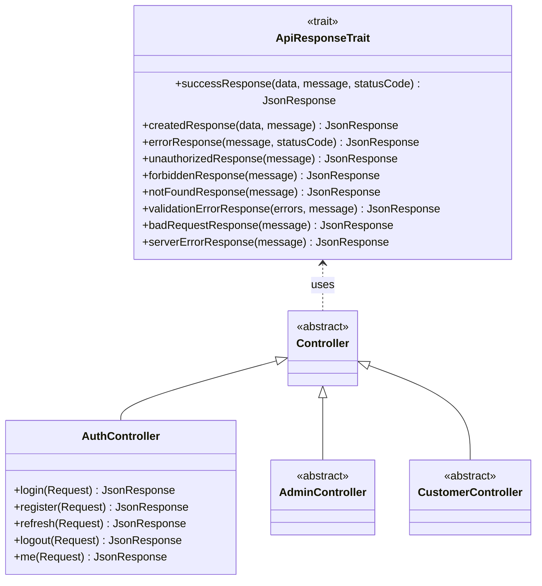
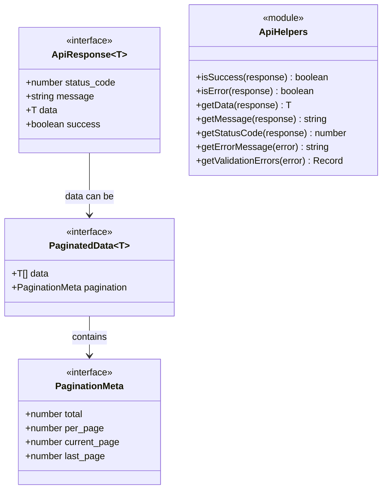
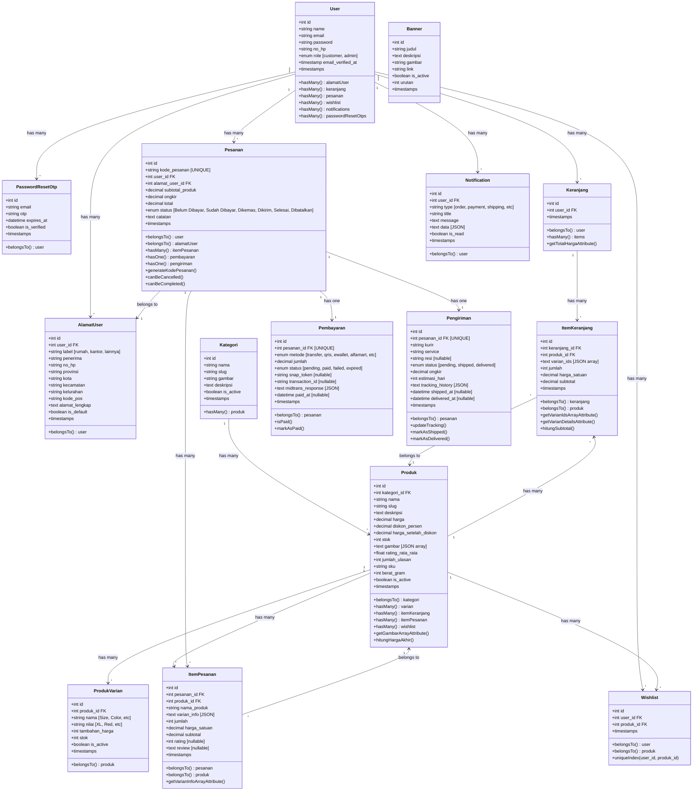

# Class Diagram

## Overview

This document outlines the Laravel Eloquent models, traits, and their relationships in the Athleon e-commerce system.

## Recent Updates (Nov 2025)

### New Components
1. **ApiResponseTrait**: Centralized response handling for all controllers
2. **Frontend API Helpers**: TypeScript interfaces and helper functions for API responses

---

## API Response Architecture



### Frontend API Types



---

## Core Models



---

## Model Details

### User Model
**File**: `app/Models/User.php`

**Relationships**:
- `hasMany(AlamatUser::class)` - User addresses
- `hasMany(Keranjang::class)` - Shopping carts
- `hasMany(Pesanan::class)` - Orders
- `hasMany(Wishlist::class)` - Wishlist items
- `hasMany(Notification::class)` - User notifications
- `hasMany(PasswordResetOtp::class, 'email', 'email')` - OTP records

**Key Methods**:
- `isAdmin()`: Check if user is admin
- `isCustomer()`: Check if user is customer

**Attributes**:
- `hidden`: password, remember_token
- `casts`: email_verified_at (datetime), password (hashed)

---

### Kategori Model
**File**: `app/Models/Kategori.php`

**Relationships**:
- `hasMany(Produk::class)` - Products in category

**Key Methods**:
- `scopeActive($query)`: Filter active categories
- `getRouteKeyName()`: Use slug for route binding

**Business Logic**:
- Slug auto-generated from nama
- Can be activated/deactivated without deleting

---

### Produk Model
**File**: `app/Models/Produk.php`

**Relationships**:
- `belongsTo(Kategori::class)` - Product category
- `hasMany(ProdukVarian::class)` - Product variants
- `hasMany(ItemKeranjang::class)` - Cart items
- `hasMany(ItemPesanan::class)` - Order items
- `hasMany(Wishlist::class)` - Wishlist entries

**Key Methods**:
- `hitungHargaAkhir()`: Calculate price after discount
- `getGambarArrayAttribute()`: Parse JSON gambar to array
- `scopeActive($query)`: Filter active products
- `scopeInStock($query)`: Filter products with stock > 0
- `updateRating()`: Recalculate average rating from reviews

**Attributes**:
- `casts`: harga (decimal:2), diskon_persen (decimal:2), rating_rata_rata (float)
- `appends`: harga_akhir (accessor)

**Business Logic**:
- Auto-calculate harga_setelah_diskon on save
- Gambar stored as JSON array
- Rating auto-updated when reviews added

---

### ProdukVarian Model
**File**: `app/Models/ProdukVarian.php`

**Relationships**:
- `belongsTo(Produk::class)` - Parent product

**Key Methods**:
- `scopeActive($query)`: Filter active variants

**Business Logic**:
- Independent stock from main product
- Additional price adds to base product price
- Can be Size, Color, Material, etc.

---

### Keranjang & ItemKeranjang Models
**Files**: `app/Models/Keranjang.php`, `app/Models/ItemKeranjang.php`

**Keranjang Relationships**:
- `belongsTo(User::class)` - Cart owner
- `hasMany(ItemKeranjang::class)` - Cart items

**Keranjang Methods**:
- `getTotalHargaAttribute()`: Calculate total cart price

**ItemKeranjang Relationships**:
- `belongsTo(Keranjang::class)` - Parent cart
- `belongsTo(Produk::class)` - Product

**ItemKeranjang Methods**:
- `hitungSubtotal()`: Calculate item subtotal
- `getVarianIdsArrayAttribute()`: Parse JSON varian_ids
- `getVarianDetailsAttribute()`: Fetch variant details

**Business Logic**:
- Varian_ids stored as JSON array: `[1, 3, 5]`
- Subtotal = harga_satuan * jumlah
- Stock validation on add/update

---

### Pesanan Model
**File**: `app/Models/Pesanan.php`

**Relationships**:
- `belongsTo(User::class)` - Customer
- `belongsTo(AlamatUser::class)` - Shipping address
- `hasMany(ItemPesanan::class)` - Order items
- `hasOne(Pembayaran::class)` - Payment record
- `hasOne(Pengiriman::class)` - Shipping record

**Key Methods**:
- `generateKodePesanan()`: Generate unique order code (ORD-YYYYMMDD-XXXX)
- `canBeCancelled()`: Check if order can be cancelled
- `canBeCompleted()`: Check if order can be completed
- `scopeByStatus($query, $status)`: Filter by status
- `scopeUnpaid($query)`: Filter unpaid orders

**Attributes**:
- `casts`: subtotal_produk (decimal:2), ongkir (decimal:2), total (decimal:2)

**Status Flow**:
```
Belum Dibayar → Sudah Dibayar → Dikemas → Dikirim → Selesai
                     ↓
                Dibatalkan
```

---

### ItemPesanan Model
**File**: `app/Models/ItemPesanan.php`

**Relationships**:
- `belongsTo(Pesanan::class)` - Parent order
- `belongsTo(Produk::class)` - Product

**Key Methods**:
- `getVarianInfoArrayAttribute()`: Parse JSON varian_info
- `canBeRated()`: Check if item can be rated (order completed)

**Attributes**:
- `casts`: varian_info (array), harga_satuan (decimal:2), subtotal (decimal:2)

**Business Logic**:
- Rating/review only after order status = Selesai
- Stores product snapshot (nama_produk) in case product deleted
- Varian_info stores selected variants as JSON

---

### Pembayaran Model
**File**: `app/Models/Pembayaran.php`

**Relationships**:
- `belongsTo(Pesanan::class)` - Parent order

**Key Methods**:
- `isPaid()`: Check if payment is successful
- `markAsPaid()`: Update status to paid & set paid_at
- `isExpired()`: Check if payment expired
- `scopePending($query)`: Filter pending payments

**Attributes**:
- `casts`: jumlah (decimal:2), midtrans_response (array), paid_at (datetime)

**Payment Status**:
- `pending`: Awaiting payment
- `paid`: Payment confirmed
- `failed`: Payment failed
- `expired`: Payment time expired

**Midtrans Integration**:
- `snap_token`: Used to open Midtrans payment modal
- `transaction_id`: Unique transaction ID from Midtrans
- `midtrans_response`: Stores full webhook payload

---

### Pengiriman Model
**File**: `app/Models/Pengiriman.php`

**Relationships**:
- `belongsTo(Pesanan::class)` - Parent order

**Key Methods**:
- `updateTracking($trackingData)`: Update tracking history
- `markAsShipped($resi)`: Set status to shipped
- `markAsDelivered()`: Set status to delivered
- `scopeInTransit($query)`: Filter shipped orders

**Attributes**:
- `casts`: ongkir (decimal:2), tracking_history (array), shipped_at (datetime), delivered_at (datetime)

**Shipping Status**:
- `pending`: Awaiting shipment
- `shipped`: Package shipped
- `delivered`: Package delivered

**Couriers Supported**:
- JNE (Reguler, Express)
- J&T Express
- SiCepat
- Ninja Xpress
- Anteraja

---

### AlamatUser Model
**File**: `app/Models/AlamatUser.php`

**Relationships**:
- `belongsTo(User::class)` - Address owner

**Key Methods**:
- `setAsDefault()`: Set this address as default
- `scopeDefault($query)`: Get default address
- `getFullAddressAttribute()`: Format full address string

**Business Logic**:
- Only one default address per user
- Uses Wilayah.id API for region data
- Labels: rumah, kantor, lainnya

---

### Wishlist Model
**File**: `app/Models/Wishlist.php`

**Relationships**:
- `belongsTo(User::class)` - User
- `belongsTo(Produk::class)` - Product

**Unique Constraint**:
- `unique(['user_id', 'produk_id'])`: Prevent duplicate wishlist entries

---

### Notification Model
**File**: `app/Models/Notification.php`

**Relationships**:
- `belongsTo(User::class)` - Notification recipient

**Key Methods**:
- `markAsRead()`: Set is_read to true
- `scopeUnread($query)`: Filter unread notifications
- `scopeByType($query, $type)`: Filter by notification type

**Notification Types**:
- `order`: Order status updates
- `payment`: Payment confirmations
- `shipping`: Shipping updates
- `promo`: Promotional messages
- `system`: System announcements

**Attributes**:
- `casts`: data (array), is_read (boolean)

---

## Eloquent Features Used

### Accessors & Mutators
```php
// Produk Model
protected function gambar(): Attribute {
    return Attribute::make(
        get: fn ($value) => json_decode($value, true),
        set: fn ($value) => json_encode($value)
    );
}
```

### Scopes
```php
// Global Scope Example
protected static function booted() {
    static::addGlobalScope('active', function (Builder $query) {
        $query->where('is_active', true);
    });
}

// Local Scope
public function scopeInStock($query) {
    return $query->where('stok', '>', 0);
}
```

### Observers
Key models use observers for:
- **Pesanan**: Generate kode_pesanan on creating
- **Keranjang**: Auto-create for new users
- **ItemKeranjang**: Update cart total on changes
- **ItemPesanan**: Update product rating on review

### Events
- `OrderPaid`: Triggered when payment confirmed
- `OrderShipped`: Triggered when order shipped
- `OrderCompleted`: Triggered when order completed
- `OrderCancelled`: Triggered when order cancelled

---

## Model Conventions

### Timestamps
All models use timestamps (`created_at`, `updated_at`) by default.

### Soft Deletes
Currently NOT implemented, but recommended for:
- User (preserve order history)
- Produk (preserve order history)
- Pesanan (audit trail)

### Mass Assignment
All models define `$fillable` arrays to protect against mass assignment vulnerabilities.

### JSON Casting
JSON columns are automatically cast to arrays:
- `produk.gambar`
- `item_keranjang.varian_ids`
- `item_pesanan.varian_info`
- `pembayaran.midtrans_response`
- `pengiriman.tracking_history`
- `notification.data`

### Route Model Binding
Key models use custom route keys:
- `Produk`: uses `slug`
- `Kategori`: uses `slug`
- `Pesanan`: uses `kode_pesanan`

---

## Database Indexing Strategy

### Primary Indexes
- All tables have `id` as primary key

### Foreign Key Indexes
Auto-indexed on all FK columns for join performance

### Unique Indexes
- `pesanan.kode_pesanan`
- `produk.slug`
- `kategori.slug`
- `pembayaran.pesanan_id`
- `pengiriman.pesanan_id`
- `wishlist(user_id, produk_id)`

### Composite Indexes
```sql
-- For order history queries
CREATE INDEX idx_pesanan_user_status ON pesanan(user_id, status);

-- For product catalog
CREATE INDEX idx_produk_kategori_active ON produk(kategori_id, is_active);

-- For cart lookups
CREATE INDEX idx_keranjang_user ON keranjang(user_id);
```

### Full-Text Search
Recommended for:
- `produk.nama`, `produk.deskripsi`
- `kategori.nama`

---

## Repository Pattern (Optional Enhancement)

While the current system uses controllers directly with models, implementing repositories could improve testability:

```php
interface PesananRepositoryInterface {
    public function findByKode(string $kode);
    public function getUserOrders(int $userId);
    public function createOrder(array $data);
}
```

---

## Service Layer Pattern

Complex business logic is extracted to services:
- `BiteshipService`: Shipping calculations
- `MidtransService`: Payment processing
- `NotificationService`: Multi-channel notifications

This keeps models focused on data and relationships, not business logic.
