# Data Flow Diagram (DFD)

## Recent Updates (Nov 2025)

### Key Improvements
1. **API Response Standardization**: All endpoints return `{ status_code, message, data }` format
2. **ApiResponseTrait**: Centralized response handling in backend (21+ controllers)
3. **Frontend Helper Functions**: `isSuccess()`, `getData()`, `getMessage()`, `getErrorMessage()`
4. **JWT Auto-Refresh**: Automatic token refresh with request queuing mechanism
5. **Backward Compatibility**: Response interceptor injects `success` for legacy code
6. **Variant Handling**: Products with/without variants handled via `loadVariants()` method
7. **Area ID Fallback**: 3-pattern search (Kelurahan+Kota, Kota, Kelurahan) for missing area_id
8. **Stock Management**: Automatic stock reduction when order status changes to "Dikemas"
9. **Security**: Clean callback URLs (no query params), encrypted product IDs in frontend
10. **UI Consistency**: Order IDs displayed as ATH{4digit}{3digit} format in frontend

---

## API Response Flow

### Response Processing Flow

---

## JWT Token Refresh Flow

---

## Level 0: Context Diagram

---

## Level 1: Main Processes

---

## Level 2: Detailed Process Flows

### 2.1 Product Browsing Process

### 2.2 Cart Management Process

### 2.3 Checkout & Payment Process

```mermaid
flowchart TB
    Customer([Customer])
    
    subgraph Checkout ["3.0 Checkout & Payment"]
        P3.1[3.1 Select Address]
        P3.2[3.2 Calculate Shipping]
        P3.3[3.3 Choose Shipping Method]
        P3.4[3.4 Choose Payment Method]
        P3.5[3.5 Create Order]
        P3.6[3.6 Generate Payment Token]
        P3.7[3.7 Process Payment]
    end
    
    DB_Alamat[(alamat_user)]
    DB_Pesanan[(pesanan)]
    DB_ItemPesanan[(item_pesanan)]
    DB_Pembayaran[(pembayaran)]
    Biteship[Biteship API]
    Midtrans[Midtrans API]
    
    Customer -->|Select| P3.1
    P3.1 -->|Get Addresses| DB_Alamat
    P3.1 -->|Check area_id| P3.1
    P3.1 -->|If null: 3-pattern search| Biteship
    Biteship -->|area_id found| P3.1
    P3.1 -->|Update area_id| DB_Alamat
    P3.1 -->|Chosen Address| P3.2
    
    P3.2 -->|Area ID + Items| Biteship
    Biteship -->|Shipping Options| P3.2
    P3.2 -->|Display with unique keys| Customer
    
    Customer -->|Choose Courier| P3.3
    P3.3 -->|Save Choice| P3.4
    
    Customer -->|Choose Method| P3.4
    P3.4 -->|Create| P3.5
    
    P3.5 -->|Insert Order| DB_Pesanan
    P3.5 -->|Load variants for items| DB_Varian
    P3.5 -->|Copy Cart Items with variants| DB_ItemPesanan
    P3.5 -->|Order Created| P3.6
    
    P3.6 -->|Create Payment Record| DB_Pembayaran
    P3.6 -->|Request Token with clean callback| Midtrans
    Midtrans -->|Snap Token| P3.6
    P3.6 -->|Token| Customer
    
    Customer -->|Pay| P3.7
    P3.7 -->|Payment Info| Midtrans
    Midtrans -->|Callback| P3.7
    P3.7 -->|Update Payment Status| DB_Pembayaran
    P3.7 -->|Update Order Status| DB_Pesanan
```

### 2.4 Order Processing

### 2.5 Shipping Management

### 2.6 Notification System

### 2.7 Admin Dashboard

---

## Data Stores

| Store | Description | Read By | Written By |
|-------|-------------|---------|------------|
| D1: users | User accounts | All processes | Registration, Profile Update |
| D2: produk | Product catalog | Browse, Cart, Checkout | Admin Product Management |
| D3: kategori | Product categories | Browse, Admin | Admin Category Management |
| D4: keranjang | Shopping carts | Cart Management | Cart Operations |
| D5: item_keranjang | Cart items | Cart Management | Cart Operations |
| D6: alamat_user | User addresses | Checkout | Address Management |
| D7: pesanan | Orders | Order Processing, Reports | Checkout Process |
| D8: item_pesanan | Order items | Order Details, Reports | Checkout Process |
| D9: pembayaran | Payments | Payment Check, Reports | Payment Process |
| D10: pengiriman | Shipments | Tracking | Shipping Management |
| D11: notifications | User notifications | Notification System | Event Triggers |
| D12: wishlist | User wishlists | Wishlist View | Wishlist Operations |
| D13: banners | Homepage banners | Public View | Admin Banner Management |
| D14: produk_varian | Product variants | Product View, Cart | Admin Product Management |

---

## External Entities

| Entity | Type | Interaction |
|--------|------|-------------|
| Customer | User | Browse, Order, Track, Review |
| Admin | User | Manage, Monitor, Report |
| Midtrans | API | Payment processing, callbacks |
| Biteship | API | Shipping calculation, tracking |
| BinderByte | API | Package tracking |
| Wilayah.id | API | Indonesian region data |

---

## Data Flow Optimization

### Caching Strategy
- **Product List**: Cache for 5 minutes
- **Categories**: Cache for 1 hour
- **Region Data**: Cache for 24 hours
- **Shipping Rates**: Cache for 1 hour per destination

### Async Processing
- Notification sending
- Report generation
- Tracking updates
- Email sending

### Rate Limiting
- External API calls throttled
- Payment webhook validation
- Admin bulk operations queued
