# Sequence Diagram

## Recent Updates (Nov 2025)

### Key Flow Improvements
1. **API Response Standardization**: All endpoints now return `{ status_code, message, data }` format
2. **JWT Auto-Refresh**: Automatic token refresh when expired, with request queuing
3. **Checkout Flow**: Added area_id fallback with 3-pattern Biteship search
4. **Variant Handling**: Cart items load variants dynamically via `loadVariants()` method
5. **Stock Reduction**: Automatic stock decrease when order status becomes "Dikemas"
6. **Payment Callback**: Clean callback URL without query parameters for security
7. **RadioGroup Fix**: Shipping methods use compound keys (courier-service) for unique selection

---

## 0. JWT Token Refresh Flow (NEW)

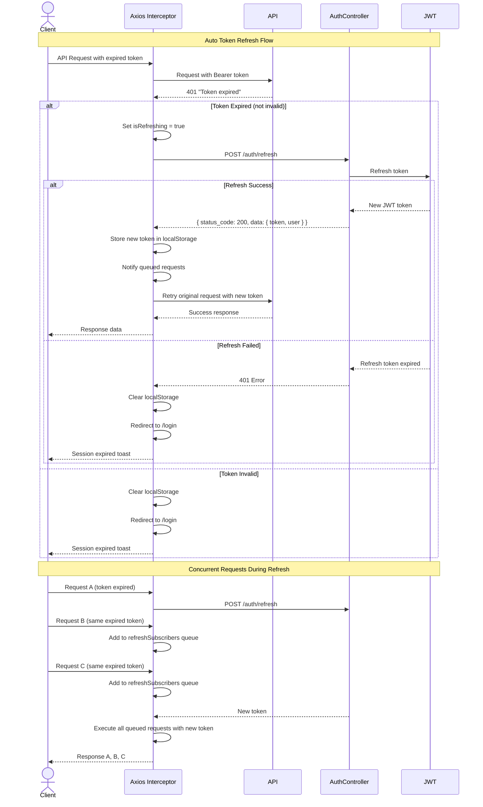

---

## 1. Customer Registration & Login Flow

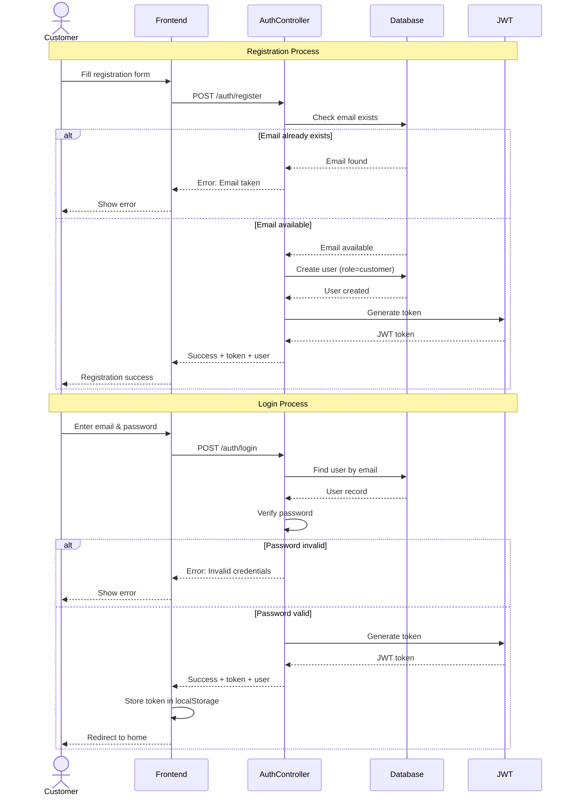

---

## 2. Browse & Add to Cart Flow

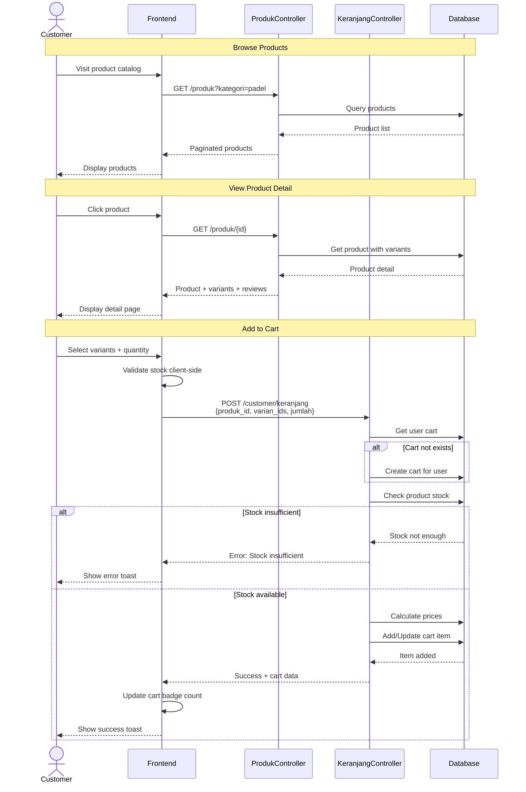

---

## 3. Checkout & Payment Flow

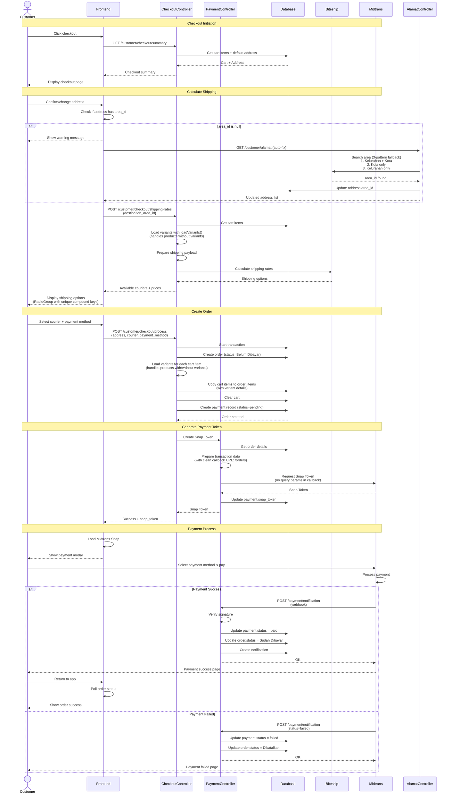

---

## 4. Admin Order Processing Flow

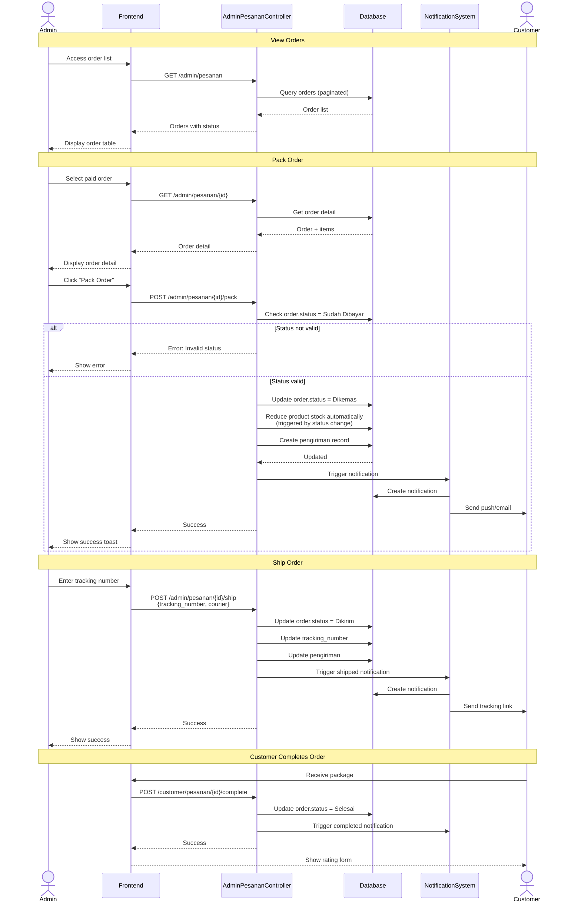

---

## 5. Shipping Tracking Flow

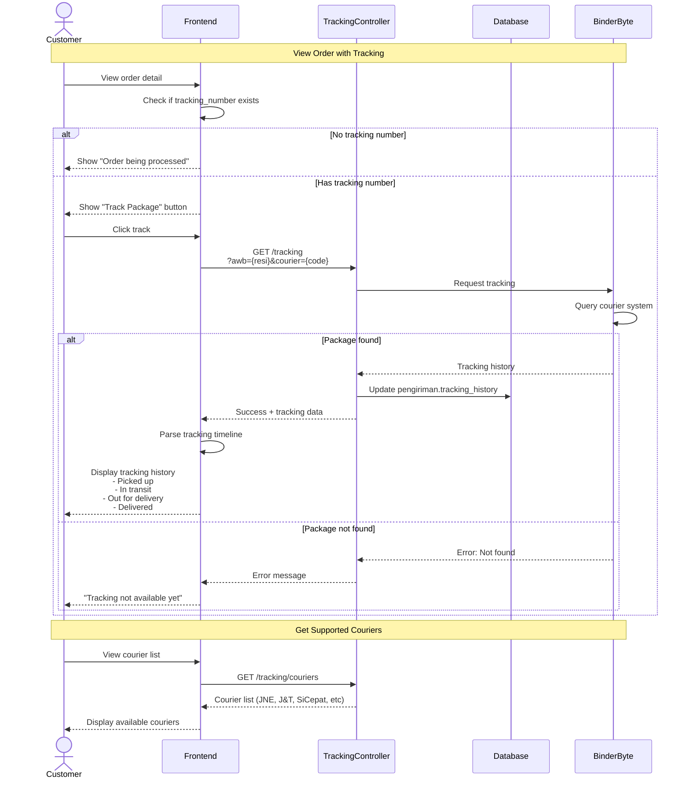

---

## 6. Wishlist Management Flow

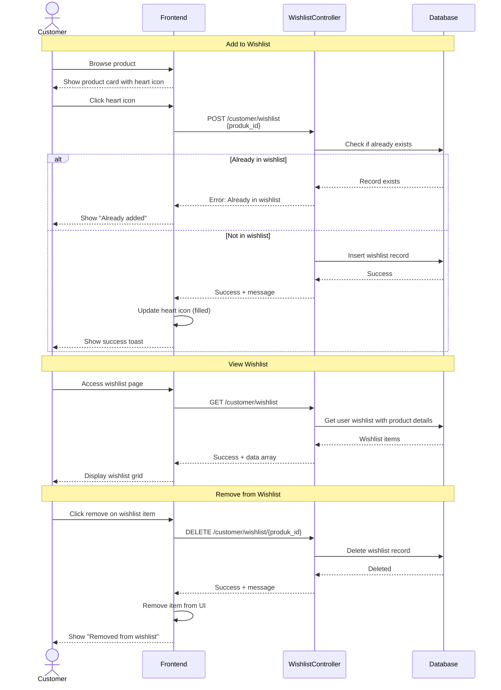

---

## 7. Product Rating & Review Flow

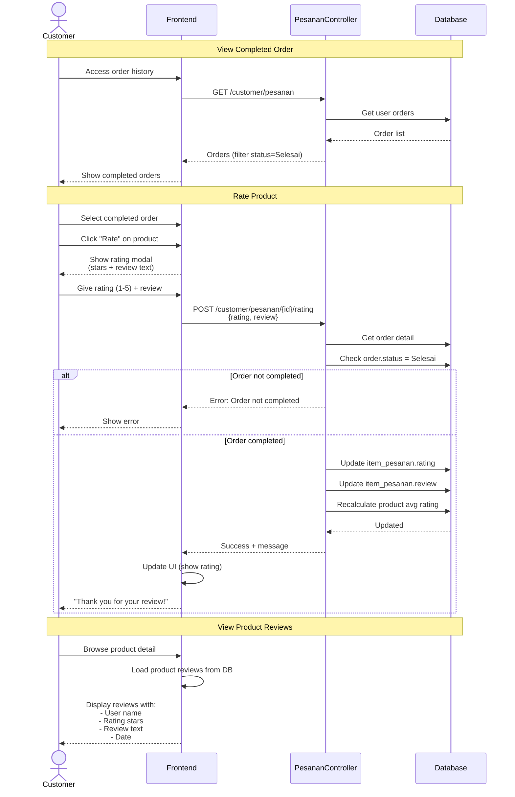

---

## 8. Admin Dashboard & Reports Flow

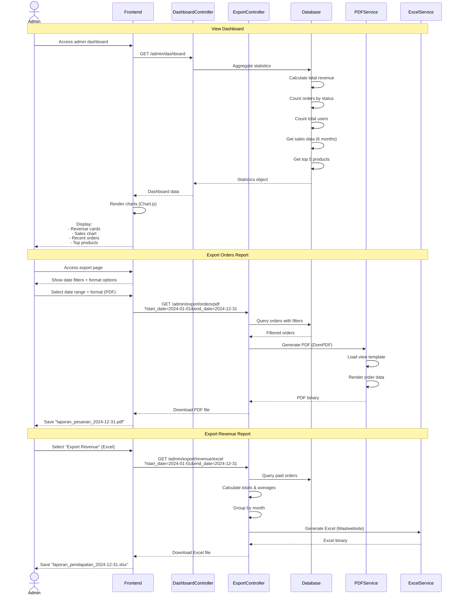

---

## 9. Password Reset with OTP Flow

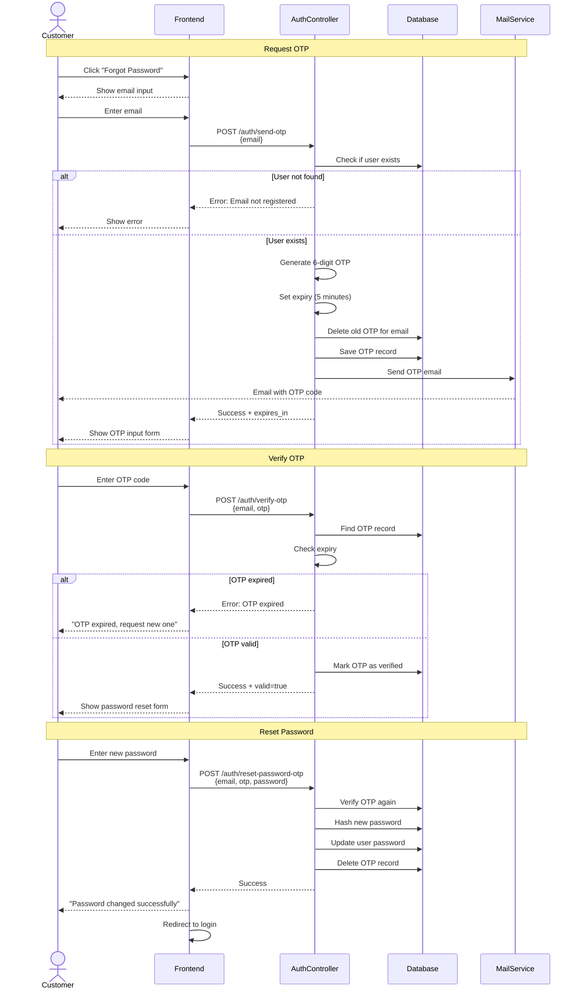

---

## 10. Notification System Flow

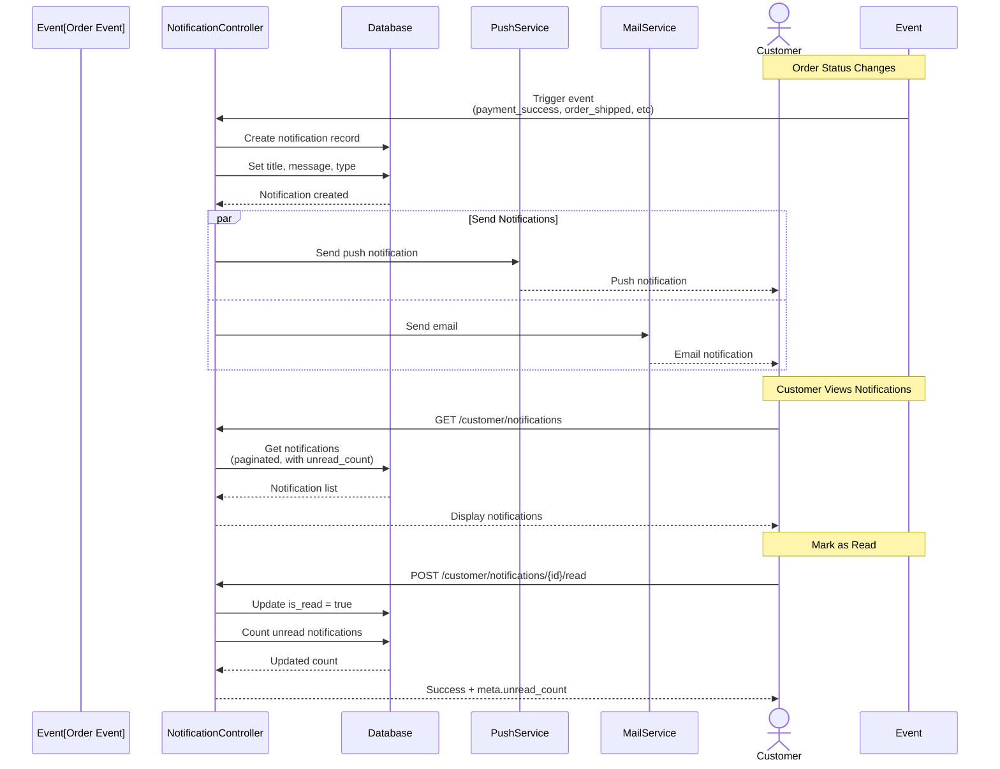

---

## Sequence Diagram Conventions

### Symbols Used
- `actor`: Human user (Customer, Admin)
- `participant`: System component
- `-->>`: Return/response
- `->>`: Request/call
- `alt/else`: Conditional flow
- `par/and`: Parallel execution
- `Note over`: Descriptive section

### Common Patterns

#### Error Handling
```
alt Success
    Component-->>Frontend: Success response
else Error
    Component-->>Frontend: Error response
    Frontend-->>User: Show error message
end
```

#### Authentication
All authenticated endpoints include JWT token in request headers:
```
Authorization: Bearer {token}
```

#### Transaction Safety
Critical operations (checkout, payment) use database transactions:
```
Database->>Database: BEGIN TRANSACTION
... operations ...
Database->>Database: COMMIT
```
