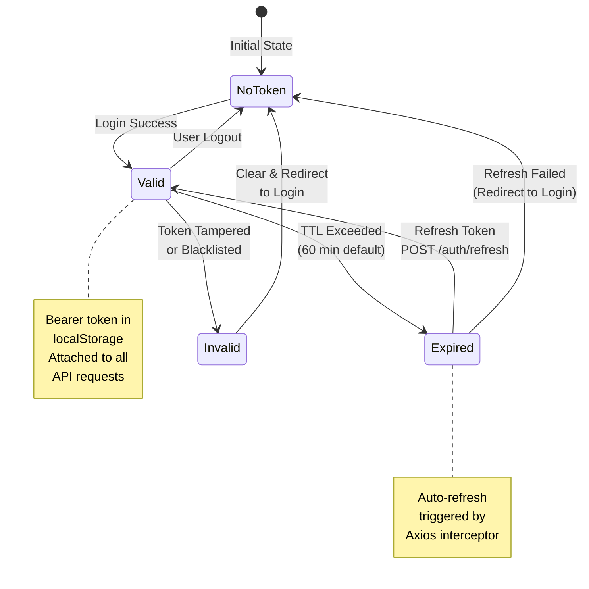
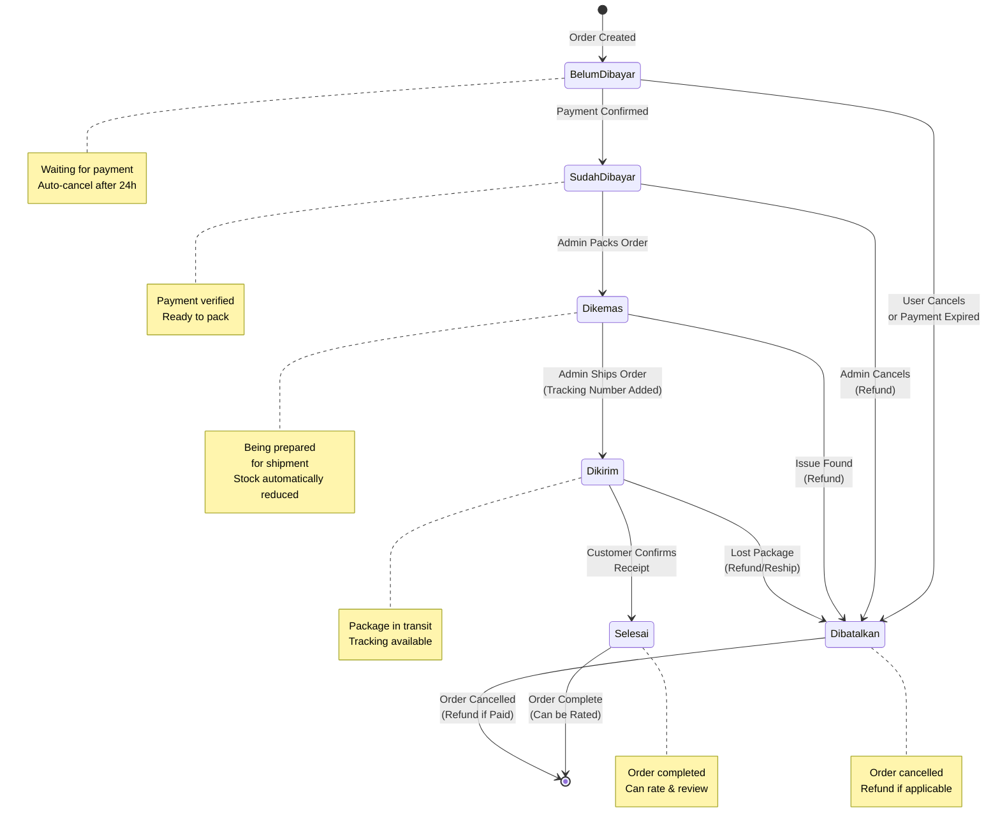
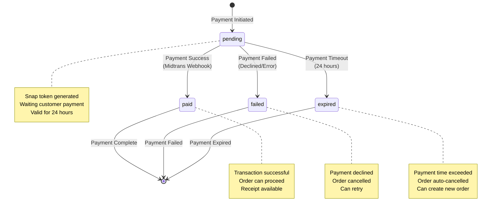
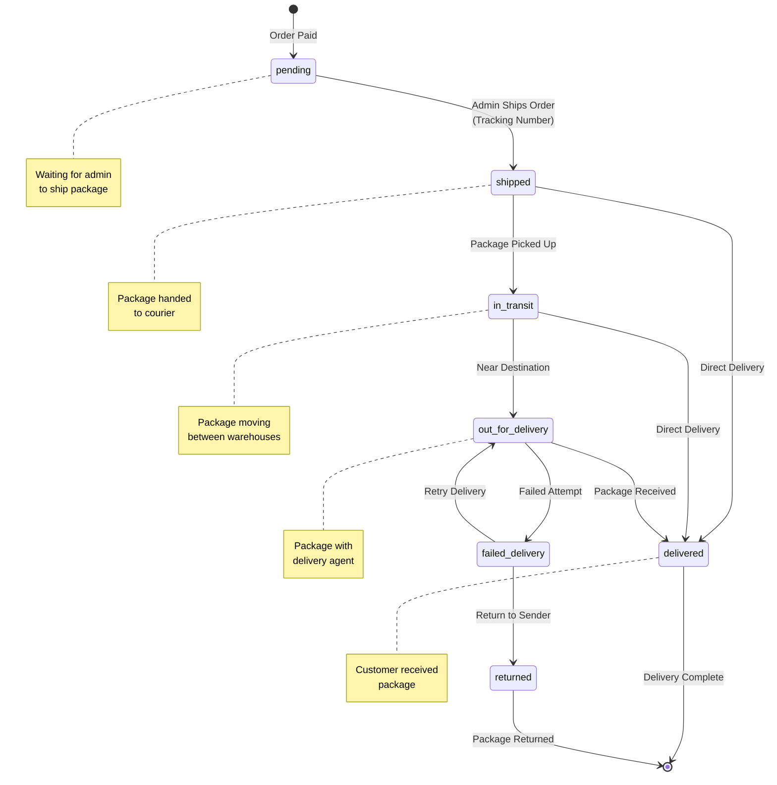
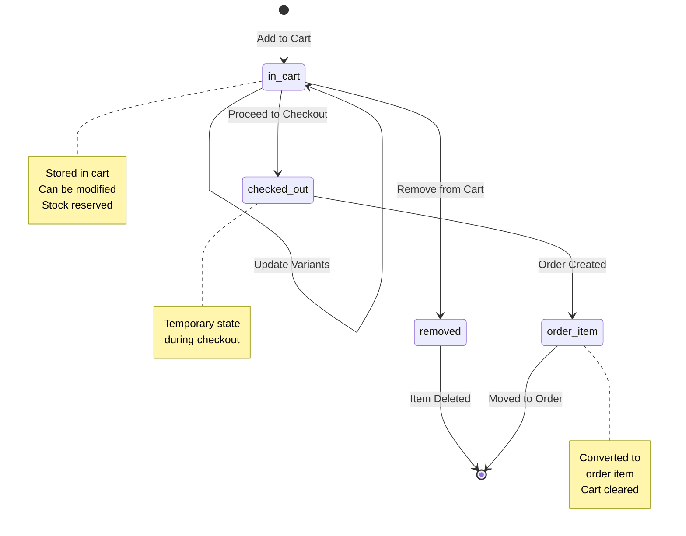
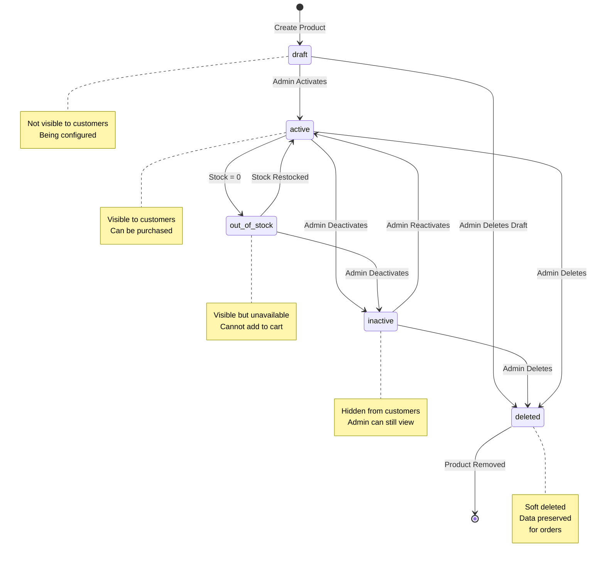
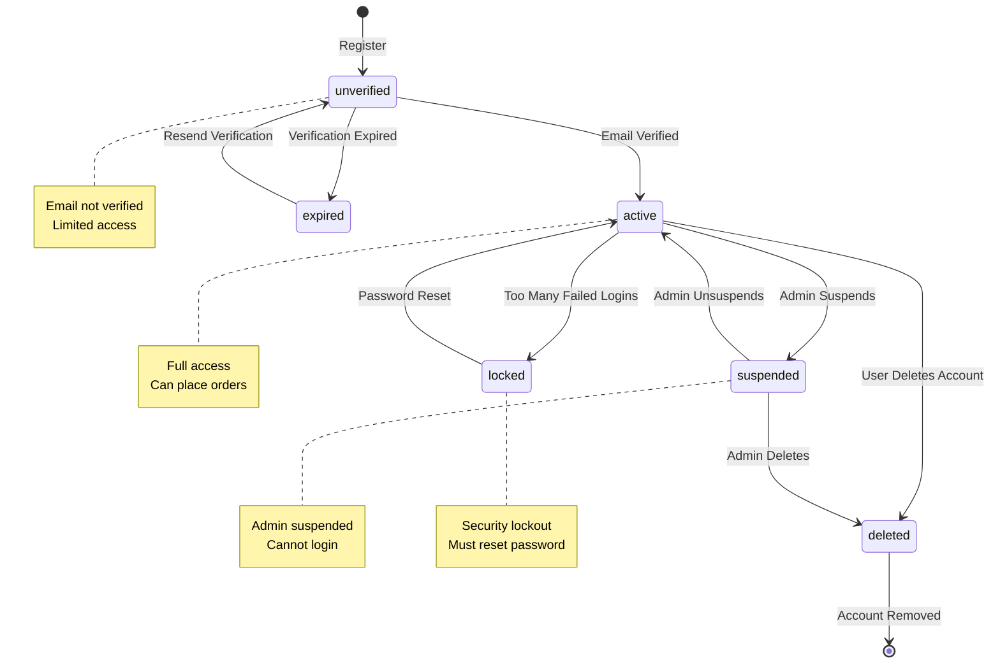
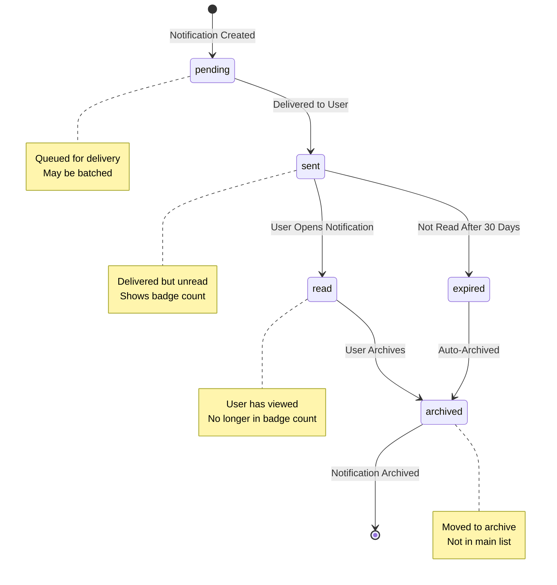

# State Diagram

This document describes the state transitions for key entities in the Athleon e-commerce system.

## Recent Updates (Nov 2025)

### API Response Standardization (v2.0)
All API responses now follow consistent format:
```json
{
  "status_code": 200,
  "message": "Success message",
  "data": { ... }
}
```

### JWT Token State
- Tokens have TTL (default 60 minutes)
- Auto-refresh mechanism in frontend
- Refresh tokens valid for 2 weeks

### State Transition Changes
1. **Stock Management**: Product stock automatically reduced when order transitions to "Dikemas" status
2. **Payment Webhook**: Status updates triggered by Midtrans webhook with signature verification
3. **Frontend Display**: Order IDs shown in ATH{4digit}{3digit} format (e.g., ATH0007123)

---

## 0. JWT Token State Diagram (NEW)



---

## 1. Order Status State Diagram



### Order Status Details

| Status | Description | Allowed Actions | Next States |
|--------|-------------|-----------------|-------------|
| **Belum Dibayar** | Order created, awaiting payment | - Cancel order<br/>- Make payment | Sudah Dibayar, Dibatalkan |
| **Sudah Dibayar** | Payment confirmed by Midtrans | - Pack order (admin)<br/>- Cancel & refund (admin) | Dikemas, Dibatalkan |
| **Dikemas** | Order being prepared for shipping<br/>**Stock automatically reduced** | - Ship order (admin)<br/>- Cancel & refund (admin) | Dikirim, Dibatalkan |
| **Dikirim** | Package shipped to customer | - Track package<br/>- Confirm receipt<br/>- Report issue | Selesai, Dibatalkan |
| **Selesai** | Order completed successfully | - Rate & review products<br/>- Reorder | [Final State] |
| **Dibatalkan** | Order cancelled | - View cancellation reason<br/>- Check refund status | [Final State] |

### Automatic State Transitions

#### Payment Expiration (Cron Job)
```
Trigger: Every 5 minutes
Condition: status = 'Belum Dibayar' AND created_at < 24 hours ago
Action: Update status to 'Dibatalkan'
```

#### Midtrans Webhook
```
Event: payment.success
Action: Update status from 'Belum Dibayar' to 'Sudah Dibayar'
Notification: Email + Push to customer
```

#### Auto-Complete (Optional)
```
Trigger: Daily cron
Condition: status = 'Dikirim' AND delivered_at < 7 days ago
Action: Update status to 'Selesai'
Rationale: Auto-confirm if customer doesn't manually confirm
```

---

## 2. Payment Status State Diagram



### Payment Status Details

| Status | Description | Triggers | Actions |
|--------|-------------|----------|---------|
| **pending** | Awaiting payment completion | - Snap token generated<br/>- Customer redirected to Midtrans | - Wait for webhook<br/>- Poll status (optional) |
| **paid** | Payment confirmed | - Midtrans webhook: transaction_status = settlement/capture | - Update order to "Sudah Dibayar"<br/>- Send confirmation email<br/>- Create notification |
| **failed** | Payment failed | - Midtrans webhook: transaction_status = deny/cancel/fail | - Update order to "Dibatalkan"<br/>- Send failure notification<br/>- Allow retry |
| **expired** | Payment expired | - Midtrans webhook: transaction_status = expire<br/>- OR Auto-expire after 24h | - Update order to "Dibatalkan"<br/>- Restore stock<br/>- Notify customer |

### Midtrans Transaction Status Mapping

| Midtrans Status | System Payment Status | Order Status | Action |
|-----------------|----------------------|--------------|---------|
| `pending` | pending | Belum Dibayar | Wait for payment |
| `settlement` | paid | Sudah Dibayar | Proceed to packing |
| `capture` | paid | Sudah Dibayar | Proceed to packing |
| `deny` | failed | Dibatalkan | Restore stock |
| `cancel` | failed | Dibatalkan | Restore stock |
| `expire` | expired | Dibatalkan | Restore stock |
| `failure` | failed | Dibatalkan | Restore stock |

---

## 3. Shipping Status State Diagram



### Shipping Status Details

| Status | Description | Update Source | Next States |
|--------|-------------|---------------|-------------|
| **pending** | Awaiting shipment | System (auto-created on payment) | shipped |
| **shipped** | Package handed to courier | Admin manual input | in_transit, delivered |
| **in_transit** | Package moving between hubs | BinderByte tracking API | out_for_delivery, delivered |
| **out_for_delivery** | Package with delivery agent | BinderByte tracking API | delivered, failed_delivery |
| **failed_delivery** | Delivery attempt failed | BinderByte tracking API | out_for_delivery, returned |
| **delivered** | Package received by customer | Customer confirmation OR auto | [Final State] |
| **returned** | Package returned to sender | BinderByte tracking API | [Final State] |

### Tracking History Format

```json
{
  "tracking_history": [
    {
      "date": "2024-01-15 10:30:00",
      "status": "shipped",
      "description": "Package picked up by JNE",
      "location": "Jakarta"
    },
    {
      "date": "2024-01-15 15:45:00",
      "status": "in_transit",
      "description": "Package arrived at sorting facility",
      "location": "Bandung Hub"
    },
    {
      "date": "2024-01-16 08:00:00",
      "status": "out_for_delivery",
      "description": "Package out for delivery",
      "location": "Bandung - Agent: John"
    },
    {
      "date": "2024-01-16 14:20:00",
      "status": "delivered",
      "description": "Package delivered - Received by: Customer",
      "location": "Bandung - Destination"
    }
  ]
}
```

---

## 4. Cart Item Lifecycle State Diagram



### Cart Operations

| Operation | Effect | Validation |
|-----------|--------|------------|
| **Add to Cart** | Create item_keranjang record | Check product is_active, stock available |
| **Update Quantity** | Modify jumlah field | Check stock sufficient |
| **Update Variants** | Modify varian_ids JSON | Check variants are_active, stock available |
| **Remove Item** | Delete item_keranjang record | None |
| **Checkout** | Copy to item_pesanan, delete cart | Verify all items still available |

---

## 5. Product Lifecycle State Diagram



### Product Visibility Rules

| State | Customer Visibility | Can Purchase | Admin Actions |
|-------|-------------------|--------------|---------------|
| **draft** | ❌ Hidden | ❌ No | Edit, Activate, Delete |
| **active** | ✅ Visible | ✅ Yes (if stock > 0) | Edit, Deactivate, Delete |
| **out_of_stock** | ⚠️ Visible (marked) | ❌ No | Restock, Edit, Deactivate |
| **inactive** | ❌ Hidden | ❌ No | Edit, Reactivate, Delete |
| **deleted** | ❌ Hidden | ❌ No | Restore (optional) |

---

## 6. User Account State Diagram



### User State Actions

| State | Login Allowed | Can Order | Can View Orders | Admin Panel |
|-------|--------------|-----------|----------------|-------------|
| **unverified** | ✅ Yes | ❌ No | ❌ No | ❌ No |
| **active** | ✅ Yes | ✅ Yes | ✅ Yes | ✅ If admin role |
| **suspended** | ❌ No | ❌ No | ❌ No | ❌ No |
| **locked** | ❌ No | ❌ No | ❌ No | ❌ No |
| **deleted** | ❌ No | ❌ No | ❌ No | ❌ No |

---

## 7. Notification State Diagram



### Notification Types & Priorities

| Type | Priority | Delivery Method | Expires After |
|------|----------|----------------|---------------|
| **order** | High | Push + Email | 30 days |
| **payment** | High | Push + Email + SMS | 30 days |
| **shipping** | Medium | Push + Email | 30 days |
| **promo** | Low | Push | 7 days |
| **system** | Medium | Push | Never |

---

## State Transition Rules

### General Rules

1. **Immutability**: Final states (Selesai, Dibatalkan, deleted) cannot transition to other states
2. **Validation**: All state changes must validate business rules before transitioning
3. **Atomicity**: State changes that affect multiple entities use database transactions
4. **Logging**: All state transitions are logged with timestamp, actor, and reason
5. **Notifications**: Most state changes trigger notifications to relevant users

### State Change Authorization

| Entity | State Change | Who Can Trigger |
|--------|-------------|-----------------|
| **Order** | Belum Dibayar → Sudah Dibayar | Midtrans webhook (auto) |
| **Order** | Sudah Dibayar → Dikemas | Admin only |
| **Order** | Dikemas → Dikirim | Admin only |
| **Order** | Dikirim → Selesai | Customer OR auto (7 days) |
| **Order** | Any → Dibatalkan | Admin OR Customer (if unpaid) |
| **Payment** | pending → paid | Midtrans webhook (auto) |
| **Payment** | pending → failed/expired | Midtrans webhook (auto) |
| **Shipping** | pending → shipped | Admin only |
| **Shipping** | shipped → * | BinderByte API (auto) |
| **Product** | * → active/inactive | Admin only |
| **User** | active → suspended | Admin only |

### Rollback Scenarios

Certain state transitions may need rollback:

```
Order: Sudah Dibayar → Dikemas
Rollback if: Admin discovers payment issue
Action: Change back to Sudah Dibayar, investigate payment
```

```
Order: Dikemas → Dikirim
Rollback if: Shipping cancelled before courier pickup
Action: Change back to Dikemas
```

### Event-Driven State Management

State transitions trigger events:

```php
// Example: Order status change
Event::fire(new OrderStatusChanged($order, $oldStatus, $newStatus));

// Listeners:
- SendNotificationToCustomer
- UpdateAnalytics
- LogStateChange
- UpdateInventory (if cancelled)
```

---

## Best Practices for State Management

1. **Use Enums**: Define states as PHP enums for type safety
2. **Guard Clauses**: Validate state transitions before executing
3. **State Machines**: Consider using state machine library for complex flows
4. **Audit Trail**: Log all state changes with actor and timestamp
5. **Consistent Naming**: Use consistent status naming across related entities
6. **Testing**: Write tests for all valid and invalid state transitions
7. **Documentation**: Keep this document updated when adding new states

### Example State Transition Code

```php
// PesananController@updateStatus
public function updateStatus(Pesanan $pesanan, string $newStatus) {
    $validTransitions = [
        'Belum Dibayar' => ['Sudah Dibayar', 'Dibatalkan'],
        'Sudah Dibayar' => ['Dikemas', 'Dibatalkan'],
        'Dikemas' => ['Dikirim', 'Dibatalkan'],
        'Dikirim' => ['Selesai', 'Dibatalkan'],
    ];
    
    if (!in_array($newStatus, $validTransitions[$pesanan->status] ?? [])) {
        throw new InvalidStateTransitionException();
    }
    
    DB::transaction(function() use ($pesanan, $newStatus) {
        $oldStatus = $pesanan->status;
        $pesanan->update(['status' => $newStatus]);
        
        event(new OrderStatusChanged($pesanan, $oldStatus, $newStatus));
    });
}
```
