# Use Case Diagram

## System Actors

### Primary Actors
- **Customer**: End user yang berbelanja
- **Admin**: Administrator sistem

### Secondary Actors
- **Midtrans**: Payment gateway system
- **Biteship**: Shipping provider system
- **BinderByte**: Tracking service

---

## Use Case Diagram - Overview

```mermaid
flowchart TB
    subgraph System["Athleon E-Commerce System"]
        subgraph Auth["Authentication & Profile"]
            UC1[Register]
            UC2[Login]
            UC3[Logout]
            UC4[Update Profile]
            UC5[Change Password]
            UC6[Reset Password with OTP]
        end
        
        subgraph Catalog["Product Catalog"]
            UC7[Browse Products]
            UC8[Search Products]
            UC9[View Product Detail]
            UC10[Filter by Category]
            UC11[View Product Reviews]
        end
        
        subgraph Shopping["Shopping Features"]
            UC12[Add to Cart]
            UC13[Update Cart]
            UC14[Remove from Cart]
            UC15[Buy Now]
            UC16[Add to Wishlist]
            UC17[Remove from Wishlist]
        end
        
        subgraph Order["Order Management"]
            UC18[Checkout]
            UC19[Calculate Shipping]
            UC20[Select Payment Method]
            UC21[Make Payment]
            UC22[View Order History]
            UC23[View Order Detail]
            UC24[Cancel Order]
            UC25[Complete Order]
            UC26[Rate Product]
            UC27[Track Order]
        end
        
        subgraph Address["Address Management"]
            UC28[Add Address]
            UC29[Edit Address]
            UC30[Delete Address]
            UC31[Set Default Address]
        end
        
        subgraph Notif["Notification"]
            UC32[View Notifications]
            UC33[Mark Notification Read]
        end
        
        subgraph AdminProduct["Admin - Product Management"]
            UC34[Create Product]
            UC35[Edit Product]
            UC36[Delete Product]
            UC37[Manage Variants]
        end
        
        subgraph AdminCategory["Admin - Category Management"]
            UC38[Create Category]
            UC39[Edit Category]
            UC40[Delete Category]
        end
        
        subgraph AdminOrder["Admin - Order Management"]
            UC41[View All Orders]
            UC42[Update Order Status]
            UC43[Pack Order]
            UC44[Ship Order]
            UC45[Cancel Order Admin]
        end
        
        subgraph AdminUser["Admin - User Management"]
            UC46[View Users]
            UC47[Edit User]
            UC48[Delete User]
        end
        
        subgraph AdminBanner["Admin - Banner Management"]
            UC49[Create Banner]
            UC50[Edit Banner]
            UC51[Delete Banner]
        end
        
        subgraph AdminReport["Admin - Reports"]
            UC52[View Dashboard]
            UC53[Export Orders]
            UC54[Export Products]
            UC55[Export Revenue]
        end
    end
    
    Customer([Customer])
    Admin([Admin])
    Midtrans[Midtrans]
    Biteship[Biteship]
    BinderByte[BinderByte]
    
    Customer --> UC1
    Customer --> UC2
    Customer --> UC3
    Customer --> UC4
    Customer --> UC5
    Customer --> UC6
    Customer --> UC7
    Customer --> UC8
    Customer --> UC9
    Customer --> UC10
    Customer --> UC11
    Customer --> UC12
    Customer --> UC13
    Customer --> UC14
    Customer --> UC15
    Customer --> UC16
    Customer --> UC17
    Customer --> UC18
    Customer --> UC19
    Customer --> UC20
    Customer --> UC21
    Customer --> UC22
    Customer --> UC23
    Customer --> UC24
    Customer --> UC25
    Customer --> UC26
    Customer --> UC27
    Customer --> UC28
    Customer --> UC29
    Customer --> UC30
    Customer --> UC31
    Customer --> UC32
    Customer --> UC33
    
    Admin --> UC2
    Admin --> UC3
    Admin --> UC4
    Admin --> UC5
    Admin --> UC34
    Admin --> UC35
    Admin --> UC36
    Admin --> UC37
    Admin --> UC38
    Admin --> UC39
    Admin --> UC40
    Admin --> UC41
    Admin --> UC42
    Admin --> UC43
    Admin --> UC44
    Admin --> UC45
    Admin --> UC46
    Admin --> UC47
    Admin --> UC48
    Admin --> UC49
    Admin --> UC50
    Admin --> UC51
    Admin --> UC52
    Admin --> UC53
    Admin --> UC54
    Admin --> UC55
    
    UC21 -.->|uses| Midtrans
    UC19 -.->|uses| Biteship
    UC27 -.->|uses| BinderByte
```

---

## Detailed Use Cases

### 1. Authentication & Profile Management

#### UC1: Register
**Actor**: Customer  
**Precondition**: User belum punya akun  
**Main Flow**:
1. User mengisi form registrasi (name, email, password, telepon)
2. System validasi data
3. System create user dengan role 'customer'
4. System kirim email verifikasi
5. User login

**Postcondition**: User account created

---

#### UC2: Login
**Actor**: Customer, Admin  
**Precondition**: User sudah punya akun  
**Main Flow**:
1. User input email & password
2. System validasi credentials
3. System generate JWT token
4. System return token & user data

**Alternative Flow**: Login gagal → error message

---

#### UC4: Update Profile
**Actor**: Customer  
**Precondition**: User sudah login  
**Main Flow**:
1. User edit profile (name, telepon, jenis_kelamin)
2. System validasi data
3. System update user record
4. System return updated data

---

#### UC6: Reset Password with OTP
**Actor**: Customer  
**Main Flow**:
1. User request OTP dengan email
2. System generate & kirim 6-digit OTP
3. User input OTP & new password
4. System verify OTP (not expired)
5. System update password
6. System delete OTP record

**Alternative Flow**: OTP expired → request new OTP

---

### 2. Product Catalog

#### UC7: Browse Products
**Actor**: Customer (Guest/Authenticated)  
**Main Flow**:
1. User access product list
2. System return paginated products
3. User can filter by category
4. User can sort (newest, price)

---

#### UC9: View Product Detail
**Actor**: Customer  
**Main Flow**:
1. User select product
2. System return product detail (variants, stock, reviews)
3. User can see ratings & reviews

---

### 3. Shopping Features

#### UC12: Add to Cart
**Actor**: Customer  
**Precondition**: User sudah login  
**Main Flow**:
1. User select product & variants
2. User input quantity
3. System check stock availability
4. System add/update item in cart
5. System return updated cart

**Alternative Flow**: Stock insufficient → error message

**Include**: UC7 (Browse Products)

---

#### UC15: Buy Now
**Actor**: Customer  
**Precondition**: User sudah login  
**Main Flow**:
1. User select product & variants from detail page
2. User input quantity
3. System validate stock
4. System prepare checkout data (tanpa masuk cart)
5. Redirect to checkout

**Include**: UC18 (Checkout)

---

#### UC16: Add to Wishlist
**Actor**: Customer  
**Precondition**: User sudah login  
**Main Flow**:
1. User click wishlist icon on product
2. System add product to wishlist
3. System return success message

**Alternative Flow**: Product already in wishlist → error

---

### 4. Order Management

#### UC18: Checkout
**Actor**: Customer  
**Precondition**: Cart not empty OR buy now selected  
**Main Flow**:
1. User review cart items
2. User select/add delivery address
3. System calculate shipping options (UC19)
4. User select shipping method
5. User select payment method
6. System create order & order items
7. System clear cart (if from cart)
8. System generate payment token (if online payment)
9. System redirect to payment

**Include**: UC19, UC20, UC21  
**Extend**: UC28 (if user add new address)

---

#### UC19: Calculate Shipping
**Actor**: Biteship API  
**Precondition**: Address & items selected  
**Main Flow**:
1. System get destination area_id
2. System prepare items data (weight, value)
3. System call Biteship API
4. Biteship return shipping options
5. System display options to user

---

#### UC21: Make Payment
**Actor**: Customer, Midtrans  
**Precondition**: Order created  
**Main Flow**:
1. System request Snap Token from Midtrans
2. System show payment modal
3. User select payment method & pay
4. Midtrans process payment
5. Midtrans send webhook to system
6. System update payment & order status
7. System send notification

**Alternative Flow**: Payment failed → order cancelled

---

#### UC24: Cancel Order
**Actor**: Customer  
**Precondition**: Order status 'Belum Dibayar' or 'Sudah Dibayar'  
**Main Flow**:
1. User select order
2. User click cancel
3. System update order status to 'Dibatalkan'
4. System send notification

**Alternative Flow**: Order already shipped → cannot cancel

---

#### UC26: Rate Product
**Actor**: Customer  
**Precondition**: Order status 'Selesai'  
**Main Flow**:
1. User select completed order
2. User select product to rate
3. User give rating (1-5) & review
4. System save rating to item_pesanan
5. System update product average rating

---

#### UC27: Track Order
**Actor**: Customer, BinderByte  
**Precondition**: Order has tracking number  
**Main Flow**:
1. User view order detail
2. User click track
3. System get tracking number
4. System call BinderByte API
5. BinderByte return tracking history
6. System display tracking timeline

---

### 5. Address Management

#### UC28: Add Address
**Actor**: Customer  
**Precondition**: User sudah login  
**Main Flow**:
1. User fill address form (label, nama, telepon, alamat lengkap, provinsi, kota, kecamatan)
2. System validate required fields
3. System fetch area_id from Biteship (optional)
4. System save address
5. System set as default if first address

---

#### UC31: Set Default Address
**Actor**: Customer  
**Main Flow**:
1. User select address
2. User set as default
3. System update all user addresses (is_default = 0)
4. System set selected address (is_default = 1)

---

### 6. Admin - Product Management

#### UC34: Create Product
**Actor**: Admin  
**Precondition**: Admin sudah login  
**Main Flow**:
1. Admin fill product form (nama, deskripsi, harga, stok, kategori, berat)
2. Admin upload gambar
3. System validate data
4. System generate slug
5. System save product
6. Admin optionally add variants (UC37)

**Alternative Flow**: Validation failed → show errors

---

#### UC37: Manage Variants
**Actor**: Admin  
**Precondition**: Product exists  
**Main Flow**:
1. Admin access product variants
2. Admin add variant (nama_varian, nilai_varian, harga_tambahan, stok_varian)
3. System save variant
4. Repeat for multiple variants (Size, Color, etc)

---

### 7. Admin - Order Management

#### UC41: View All Orders
**Actor**: Admin  
**Main Flow**:
1. Admin access order list
2. Admin can filter by status
3. System return paginated orders
4. Admin can search by order code

---

#### UC43: Pack Order
**Actor**: Admin  
**Precondition**: Order status 'Sudah Dibayar'  
**Main Flow**:
1. Admin select order
2. Admin click "Pack"
3. System update order status to 'Dikemas'
4. System create pengiriman record
5. System send notification to customer

---

#### UC44: Ship Order
**Actor**: Admin  
**Precondition**: Order status 'Dikemas'  
**Main Flow**:
1. Admin select order
2. Admin input tracking number & courier info
3. System update order status to 'Dikirim'
4. System update pengiriman record
5. System send notification with tracking link

---

### 8. Admin - Reports

#### UC52: View Dashboard
**Actor**: Admin  
**Main Flow**:
1. Admin access dashboard
2. System aggregate statistics:
   - Total revenue
   - Total orders
   - Total products
   - Total users
   - Revenue growth
   - Recent orders
   - Sales data (6 months)
   - Top products (top 5)
3. System display charts & metrics

---

#### UC53: Export Orders
**Actor**: Admin  
**Main Flow**:
1. Admin access export page
2. Admin select date range & status filter
3. Admin choose format (PDF/Excel)
4. System query orders
5. System generate file
6. System download file to admin

---

## Use Case Relationships

### Include Relationships
- **Checkout** includes **Calculate Shipping**
- **Checkout** includes **Make Payment**
- **Add to Cart** includes **Browse Products**
- **Buy Now** includes **Checkout**

### Extend Relationships
- **View Product Detail** extends **Add to Wishlist**
- **View Order Detail** extends **Track Order**
- **Checkout** extends **Add Address** (if no address exists)

### Generalization
- **Login** is used by both Customer & Admin
- **Update Profile** is used by both Customer & Admin
- **View Notifications** is used by both Customer & Admin

---

## Use Case Priorities

### High Priority (Core Features)
- UC2: Login
- UC7: Browse Products
- UC12: Add to Cart
- UC18: Checkout
- UC21: Make Payment
- UC34: Create Product
- UC41: View All Orders

### Medium Priority
- UC16: Add to Wishlist
- UC26: Rate Product
- UC27: Track Order
- UC37: Manage Variants
- UC52: View Dashboard

### Low Priority
- UC6: Reset Password with OTP
- UC53-55: Export Reports
- UC49-51: Banner Management

---

## Access Control Matrix

| Use Case | Guest | Customer | Admin |
|----------|-------|----------|-------|
| Browse Products | ✓ | ✓ | ✓ |
| View Product Detail | ✓ | ✓ | ✓ |
| Register | ✓ | - | - |
| Login | ✓ | ✓ | ✓ |
| Add to Cart | - | ✓ | - |
| Checkout | - | ✓ | - |
| Make Payment | - | ✓ | - |
| View Order History | - | ✓ | - |
| Add to Wishlist | - | ✓ | - |
| Manage Products | - | - | ✓ |
| Manage Orders | - | - | ✓ |
| Manage Users | - | - | ✓ |
| View Dashboard | - | - | ✓ |
| Export Reports | - | - | ✓ |
