# Athleon API Documentation

> **Stack**: Laravel 11 + JWT Auth + Midtrans + Biteship. All endpoints live under the `/api` prefix.

## Quick Start
- **Base URL (prod)**: `https://api.athleon.com/api`
- **Base URL (local)**: `http://localhost:8000/api`
- **Content-Type**: `application/json`
- **Auth**: Bearer token returned by `/auth/login` (JWT). Attach via `Authorization: Bearer <token>`.
- **Pagination**: Standard `page`, `per_page` query params when supported by controllers.
- **Postman variables**: set `{{base_url}}`, `{{admin_token}}`, `{{customer_token}}`, `{{midtrans_server_key}}`.

## Standardized Response Format (v2.0)

All API endpoints return responses in a consistent format:

### Success Response
```json
{
  "status_code": 200,
  "message": "Operation berhasil",
  "data": {
    // Response data here
  }
}
```

### Error Response
```json
{
  "status_code": 400,
  "message": "Error message",
  "data": null
}
```

### Validation Error Response
```json
{
  "status_code": 422,
  "message": "Validation error",
  "data": {
    "errors": {
      "field_name": ["Error message 1", "Error message 2"]
    }
  }
}
```

### Paginated Response
```json
{
  "status_code": 200,
  "message": "Data retrieved successfully",
  "data": {
    "data": [...],
    "pagination": {
      "total": 100,
      "per_page": 20,
      "current_page": 1,
      "last_page": 5
    }
  }
}
```

### Status Codes
| Code | Meaning | Method |
| --- | --- | --- |
| 200 | Success | `successResponse()` |
| 201 | Created | `createdResponse()` |
| 400 | Bad Request | `badRequestResponse()` |
| 401 | Unauthorized | `unauthorizedResponse()` |
| 403 | Forbidden | `forbiddenResponse()` |
| 404 | Not Found | `notFoundResponse()` |
| 422 | Validation Error | `validationErrorResponse()` |
| 500 | Server Error | `serverErrorResponse()` |

## Postman Collection Blueprint
| Folder | Purpose | Key Endpoints |
| --- | --- | --- |
| Auth | Registration, login, OTP and token lifecycle | `/auth/register`, `/auth/login`, `/auth/refresh`, `/auth/send-otp`, `/auth/reset-password-otp`
| Public Catalog | No auth — storefront data | `/produk`, `/produk/{id}`, `/banners`, `/kategori`
| Wilayah & Tracking | Support data for forms & shipment tracking | `/wilayah/*`, `/tracking`, `/tracking/couriers`
| Customer | Requires `jwt.auth` + `role:customer` | `/customer/profile`, `/customer/keranjang`, `/customer/wishlist`, `/customer/pesanan`
| Checkout & Payment | Customer checkout, payment, shipping | `/customer/checkout/*`, `/customer/payment/*`, `/customer/shipping/*`
| Admin | Requires `jwt.auth` + `role:admin` | `/admin/dashboard`, `/admin/produk`, `/admin/pesanan`, `/admin/export/*`
| Webhooks & Legacy | Public callback endpoints | `/payment/notification`, `/payment/notification-legacy`, `/payment/finish`

## Endpoint Catalog (ready for Postman)

### 1. Authentication & Profile
| Method | Path | Description | Auth | Sample body |
| --- | --- | --- | --- | --- |
| POST | `/auth/register` | Customer sign-up | None | `{ "name": "Jane", "email": "jane@ex.com", "password": "Secret123", "telepon": "0812" }`
| POST | `/auth/login` | Obtain JWT | None | `{ "email": "admin@athleon.com", "password": "Secret123" }`
| POST | `/auth/logout` | Invalidate current token | Bearer | — |
| POST | `/auth/refresh` | Rotate/refresh JWT token | Bearer | — |
| POST | `/auth/me` | Profile (POST alias) | Bearer | — |
| GET | `/auth/user` | Profile (GET alias) | Bearer | — |
| POST | `/auth/send-otp` | Send password reset OTP | None | `{ "email": "jane@ex.com" }`
| POST | `/auth/verify-otp` | Verify OTP before reset | None | `{ "email": "jane@ex.com", "otp": "123456" }`
| POST | `/auth/reset-password-otp` | Set new password w/ valid OTP | None | `{ "email": "jane@ex.com", "otp": "123456", "password": "Baru123" }`
| POST | `/auth/change-password` | Customer password change | Bearer + `role:customer` | `{ "current_password": "Secret123", "password": "Baru123" }`
| PUT | `/customer/profile` | Update name/phone/gender/avatar | Bearer + `role:customer` | `{ "name": "Jane Updated", "telepon": "08123" }`

#### Login Response Example
```json
{
  "status_code": 200,
  "message": "Login berhasil",
  "data": {
    "token": "eyJ0eXAiOiJKV1QiLCJhbGciOiJIUzI1NiJ9...",
    "user": {
      "id": 1,
      "name": "John Doe",
      "email": "john@example.com",
      "role": "customer"
    }
  }
}
```

#### Refresh Token Response
```json
{
  "status_code": 200,
  "message": "Token refreshed successfully",
  "data": {
    "token": "eyJ0eXAiOiJKV1QiLCJhbGciOiJIUzI1NiJ9...",
    "user": {
      "id": 1,
      "name": "John Doe",
      "email": "john@example.com",
      "role": "customer"
    }
  }
}
```

### 2. Public Catalog & Meta
| Method | Path | Description |
| --- | --- | --- |
| GET | `/produk` | List products (supports `?kategori=`, `?search=`, `?sort=`)
| GET | `/produk/{id}` | Product detail + variants + rating
| GET | `/banners` | Homepage banners
| GET | `/kategori` | All categories (admin controller reused)
| GET | `/wilayah/provinces` | Provinces reference data (Biteship)
| GET | `/wilayah/cities/{provinceCode}` | Cities by province
| GET | `/wilayah/districts/{cityCode}` | Districts by city
| GET | `/wilayah/villages/{districtCode}` | Villages by district
| GET | `/tracking` | Track shipment (requires `waybill`, `courier` params)
| GET | `/tracking/couriers` | List supported couriers

### 3. Customer Domain (`/customer`, JWT + role:customer)
**Addresses**
| Method | Path | Description |
| --- | --- | --- |
| GET | `/alamat` | List saved addresses
| GET | `/alamat/{id}` | Address detail
| POST | `/alamat` | Create address (supports `area_id`, lat/long)
| PUT | `/alamat/{id}` | Update address
| DELETE | `/alamat/{id}` | Delete address
| POST | `/alamat/{id}/set-default` | Flag as default
| POST | `/alamat/{id}/force-update-area-id` | Force-sync Biteship `area_id`

**Keranjang & Wishlist**
| Method | Path | Description |
| --- | --- | --- |
| GET | `/keranjang` | View cart items
| POST | `/keranjang` | Add product / variant to cart
| PUT | `/keranjang/{id}` | Update quantity / variant
| DELETE | `/keranjang/{id}` | Remove item
| POST | `/buy-now` | Direct checkout for single item
| GET | `/wishlist` | List wishlist items
| POST | `/wishlist` | Add to wishlist
| DELETE | `/wishlist/{produk}` | Remove product

**Notifications**
| Method | Path | Description |
| --- | --- | --- |
| GET | `/notifications` | List notifications (user scoped)
| POST | `/notifications` | Create custom notification (client-driven)
| POST | `/notifications/{notification}/read` | Mark one as read
| POST | `/notifications/read-all` | Mark all read

**Checkout & Orders**
| Method | Path | Description |
| --- | --- | --- |
| GET | `/checkout/summary` | Summaries cart + address + shipping
| POST | `/checkout/shipping-rates` | Fetch Biteship rates (needs origin/destination/payload)
| POST | `/checkout/process` | Persist order, reserve stock, spawn payment
| POST | `/payment/create-token` | Midtrans Snap token for client checkout
| POST | `/payment/check-status` | Poll payment state via Midtrans API
| POST | `/shipping/rates` | Alternative rate endpoint
| POST | `/shipping/track` | Track shipment via Biteship by order

**Pesanan**
| Method | Path | Description |
| --- | --- | --- |
| GET | `/pesanan` | List user orders (filters: status, date)
| GET | `/pesanan/{id}` | Order detail with items, payment, shipping
| POST | `/pesanan` | Checkout from cart (alias of process)
| PUT | `/pesanan/{id}/status` | Customer status update (cancel/complete)
| POST | `/pesanan/{id}/cancel` | Cancel order (pre shipment)
| POST | `/pesanan/{id}/complete` | Confirm receipt
| POST | `/pesanan/{id}/rating` | Rate completed order
| GET | `/pesanan/{id}/tracking` | Live tracking via Biteship

### 4. Admin Domain (`/admin`, JWT + role:admin)
| Method | Path | Description |
| --- | --- | --- |
| GET | `/dashboard` | KPIs (orders, revenue, top customers)
| GET | `/produk` | List products (with filters)
| POST | `/produk` | Create product + variants + media
| GET | `/produk/{id}` | Show product detail
| PUT | `/produk/{id}` | Update product
| DELETE | `/produk/{id}` | Delete/soft-delete product
| GET | `/kategori` | List categories
| POST | `/kategori` | Create category
| PUT | `/kategori/{kategori}` | Update category
| DELETE | `/kategori/{kategori}` | Remove category
| GET | `/banners` | List banners
| POST | `/banners` | Create banner (FormData, image upload)
| GET | `/banners/{id}` | View banner
| PUT | `/banners/{id}` | Update banner (JSON)
| POST | `/banners/{id}` | Update banner (FormData alias)
| DELETE | `/banners/{id}` | Delete banner
| GET | `/users` | List customers/admins
| GET | `/users/{id}` | Show user
| PUT | `/users/{id}` | Update role/profile
| DELETE | `/users/{id}` | Delete user
| GET | `/pesanan` | List all orders (filters/sort)
| GET | `/pesanan/{id}` | Order detail
| PUT | `/pesanan/{id}/status` | Force status transition
| PUT | `/pesanan/{id}/tracking` | Set tracking number / courier
| POST | `/pesanan/{id}/pack` | Mark as packed
| POST | `/pesanan/{id}/ship` | Mark as shipped
| POST | `/pesanan/{id}/complete` | Mark as completed
| POST | `/pesanan/{id}/cancel` | Cancel order
| GET | `/orders` | Alias for `/pesanan`
| GET | `/orders/{id}` | Alias detail
| GET | `/notifications` | List admin notifications
| POST | `/notifications` | Create broadcast
| POST | `/notifications/{notification}/read` | Mark one read
| POST | `/notifications/read-all` | Mark all read
| GET | `/export/orders/pdf` | Orders PDF
| GET | `/export/orders/excel` | Orders Excel (`OrdersExport`)
| GET | `/export/products/pdf` | Products PDF
| GET | `/export/products/excel` | Products Excel
| GET | `/export/revenue/pdf` | Revenue PDF
| GET | `/export/revenue/excel` | Revenue Excel

### 5. Payment & Webhooks
| Method | Path | Description |
| --- | --- | --- |
| POST | `/payment/notification` | Midtrans webhook (new flow)
| POST | `/payment/notification-legacy` | Legacy webhook handled by `PaymentController`
| GET | `/payment/finish` | Midtrans redirect landing page (success/cancel)

### Sample Postman Request/Response Blocks

**Login Request/Response**
```http
POST {{base_url}}/auth/login
Content-Type: application/json

{
  "email": "customer@example.com",
  "password": "password123"
}
```

**Response:**
```json
{
  "status_code": 200,
  "message": "Login berhasil",
  "data": {
    "token": "eyJ0eXAiOiJKV1QiLCJhbGciOiJIUzI1NiJ9...",
    "user": {
      "id": 7,
      "name": "Customer",
      "email": "customer@example.com",
      "role": "customer"
    }
  }
}
```

**Refresh Token Request/Response**
```http
POST {{base_url}}/auth/refresh
Authorization: Bearer {{customer_token}}
```

**Response:**
```json
{
  "status_code": 200,
  "message": "Token refreshed successfully",
  "data": {
    "token": "eyJ0eXAiOiJKV1QiLCJhbGciOiJIUzI1NiJ9...",
    "user": {
      "id": 7,
      "name": "Customer",
      "email": "customer@example.com",
      "role": "customer"
    }
  }
}
```

**Create Snap Token**
```http
POST {{base_url}}/customer/payment/create-token
Authorization: Bearer {{customer_token}}
Content-Type: application/json

{
  "order_id": "INV-2025-10-001",
  "amount": 150000,
  "customer": {
    "name": "Jane Doe",
    "email": "jane@example.com",
    "phone": "08123456789"
  },
  "items": [
    {"id": 45, "name": "Athleon Pro Jersey", "price": 120000, "quantity": 1},
    {"id": 87, "name": "Shipping", "price": 30000, "quantity": 1}
  ]
}
```

**Checkout Process Response**
```json
{
  "status_code": 200,
  "message": "Checkout berhasil",
  "data": {
    "order": {
      "id": 451,
      "status": "Menunggu Pembayaran",
      "total_harga": 150000,
      "ongkir": 30000,
      "items": [
        {
          "produk_id": 45,
          "nama": "Athleon Pro Jersey",
          "varians": ["Ukuran: L", "Warna: Hitam"],
          "jumlah": 1,
          "subtotal": 150000
        }
      ]
    },
    "midtrans": {
      "snap_token": "82c512f6-...",
      "redirect_url": "https://app.midtrans.com/snap/v3/redirection/82c512f6-..."
    }
  }
}
```

**Notifications Response**
```json
{
  "status_code": 200,
  "message": "Notifikasi berhasil diambil",
  "data": {
    "notifications": [
      {
        "id": 5,
        "user_id": 7,
        "pesanan_id": 10,
        "type": "order_created",
        "title": "Pesanan Dibuat",
        "message": "Pesanan Anda telah berhasil dibuat.",
        "is_read": 0,
        "read_at": null,
        "sent_at": "2025-11-27T04:46:30.000000Z"
      }
    ],
    "pagination": {
      "total": 5,
      "per_page": 20,
      "current_page": 1,
      "last_page": 1
    },
    "meta": {
      "unread_count": 1
    }
  }
}
```

## Flow Diagrams (Mermaid-ready)

### Customer Journey (User Flow)
```mermaid
flowchart TD
    A[Landing & Catalog \n GET /produk] --> B[View Product Detail]
    B --> C[Add to Cart \n POST /customer/keranjang]
    C --> D[Checkout Summary \n GET /customer/checkout/summary]
    D --> E[Choose Address & Shipping \n POST /customer/checkout/shipping-rates]
    E --> F[Process Checkout \n POST /customer/checkout/process]
    F --> G[Create Midtrans Token \n POST /customer/payment/create-token]
    G --> H[Snap Payment UI]
    H --> I[Payment Notification \n /payment/notification]
    I --> J[Order Status Update \n Pesanan status + Notification]
    J --> K[Shipment Tracking \n GET /customer/pesanan/{id}/tracking]
    K --> L[Complete & Rate \n POST /customer/pesanan/{id}/rating]
```

### Admin Flow (Order Management)
```mermaid
flowchart LR
    A[Login Admin \n POST /auth/login] --> B[Dashboard KPIs]
    B --> C[Review Orders \n GET /admin/pesanan]
    C --> D[Mark as Packed \n POST /admin/pesanan/{id}/pack]
    D --> E[Input Tracking \n PUT /admin/pesanan/{id}/tracking]
    E --> F[Mark as Shipped \n POST /admin/pesanan/{id}/ship]
    F --> G[Mark as Completed \n POST /admin/pesanan/{id}/complete]
    C --> H[Cancel Order \n POST /admin/pesanan/{id}/cancel]
    B --> I[Manage Catalog \n /admin/produk, /admin/kategori]
    B --> J[Broadcast Notice \n /admin/notifications]
    B --> K[Export Reports \n /admin/export/*]
```

### Payment Flow


### Shipping Flow
```mermaid
flowchart TD
    A[Checkout Summary] --> B[POST /customer/checkout/shipping-rates]
    B --> C[Select Courier + Service]
    C --> D[Order Confirmed]
    D --> E[Admin Packs Order]
    E --> F[Tracking No. set via PUT /admin/pesanan/{id}/tracking]
    F --> G[POST /customer/shipping/track]
    G --> H[GET /customer/pesanan/{id}/tracking]
    H --> I[Delivery Complete -> POST /customer/pesanan/{id}/complete]
```

## ERD (Mermaid + Workbench Export Notes)

To export from **MySQL Workbench**: reverse-engineer the Athleon schema → arrange tables → `File > Export > Forward Engineer SQL CREATE Script` for DDL or `File > Export > as PNG` for visual copy. The following Mermaid ER diagram mirrors the final schema and can be pasted into Markdown, Notion, Confluence, etc.

```mermaid
erDiagram
    USER ||--o{ ALAMAT_USER : has
    USER ||--o{ KERANJANG : owns
    USER ||--o{ PESANAN : places
    USER ||--o{ WISHLIST : bookmarks
    USER ||--o{ NOTIFICATION : receives

    KERANJANG ||--o{ ITEM_KERANJANG : contains
    PESANAN ||--o{ ITEM_PESANAN : includes
    PESANAN ||--|| PEMBAYARAN : has
    PESANAN ||--|| PENGIRIMAN : ships
    PESANAN ||--o{ NOTIFICATION : triggers

    KATEGORI ||--o{ PRODUK : classifies
    PRODUK ||--o{ PRODUK_VARIAN : options
    PRODUK ||--o{ ITEM_PESANAN : referenced
    PRODUK ||--o{ ITEM_KERANJANG : referenced
    PRODUK ||--o{ WISHLIST : favorited

    WISHLIST }o--|| USER : belongsTo
    WISHLIST }o--|| PRODUK : targets

    ITEM_PESANAN }o--|| PRODUK : references
    ITEM_PESANAN }o--|| PRODUK_VARIAN : variant

    ITEM_KERANJANG }o--|| PRODUK : references
    ITEM_KERANJANG }o--|| PRODUK_VARIAN : variant

    BANNER {
        int id PK
        string judul
        string deskripsi
        string gambar
        bool is_active
    }

    KATEGORI {
        int id PK
        string nama
        string deskripsi
        string gambar
    }

    PRODUK {
        int id PK
        int idKategori FK
        string nama
        text deskripsi
        decimal harga
        int stok
        json galeri
        json varian
        json panduan_ukuran
    }

    PRODUK_VARIAN {
        int id PK
        int produk_id FK
        string nama_varian
        string nilai_varian
        decimal harga_tambahan
        int stok
    }

    USER {
        int id PK
        string name
        string email
        string password
        enum role
        string telepon
        string jenis_kelamin
    }

    ALAMAT_USER {
        int id PK
        int user_id FK
        string label
        string nama_penerima
        string telepon_penerima
        string alamat_lengkap
        string provinsi
        string kota
        string kecamatan
        string kelurahan
        string kode_pos
        string area_id
        decimal latitude
        decimal longitude
        bool is_default
    }

    KERANJANG {
        int id PK
        int user_id FK
        decimal total_harga
    }

    ITEM_KERANJANG {
        int id PK
        int keranjang_id FK
        int produk_id FK
        int varian_id FK
        json varian_ids
        string varian_label
        decimal harga_varian
        int jumlah
        decimal subtotal
    }

    PESANAN {
        int id PK
        int user_id FK
        datetime tanggal_pesanan
        decimal total_harga
        decimal ongkir
        enum status
        text alamat_pengiriman
        string metode_pembayaran
        string metode_pengiriman
        string kurir_code
        string kurir_service
        string tracking_number
        string nama_penerima
        string nomor_telepon
        tinyint rating
        text rating_feedback
    }

    ITEM_PESANAN {
        int id PK
        int pesanan_id FK
        int produk_id FK
        int varian_id FK
        string varian_label
        decimal harga_varian
        int jumlah
        decimal harga_satuan
    }

    PEMBAYARAN {
        int id PK
        int pesanan_id FK
        decimal jumlah_bayar
        date tanggal_bayar
        string metode
        string snap_token
        string transaction_id
        enum status
    }

    PENGIRIMAN {
        int id PK
        int pesanan_id FK
        string nomor_resi
        string provider
        enum status
    }

    NOTIFICATION {
        int id PK
        int user_id FK
        int pesanan_id FK
        int pembayaran_id FK
        string title
        string message
        string type
        enum target_role
        json data
        datetime sent_at
        datetime read_at
    }
```



## Next Steps
1. **Import to Postman**: Build a collection mirroring the folders above, add `{{base_url}}` and tokens as environment variables, then paste example payloads into request bodies.
2. **Sync with QA/staging**: Duplicate environment for staging vs prod base URLs.
3. **Keep diagrams close**: Copy-paste the Mermaid blocks into docs/Notion or convert to SVG via Mermaid Live Editor for stakeholder decks.
